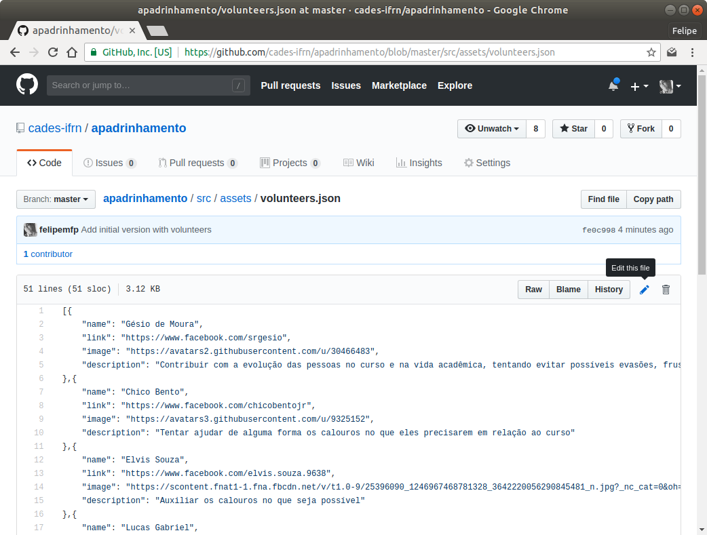
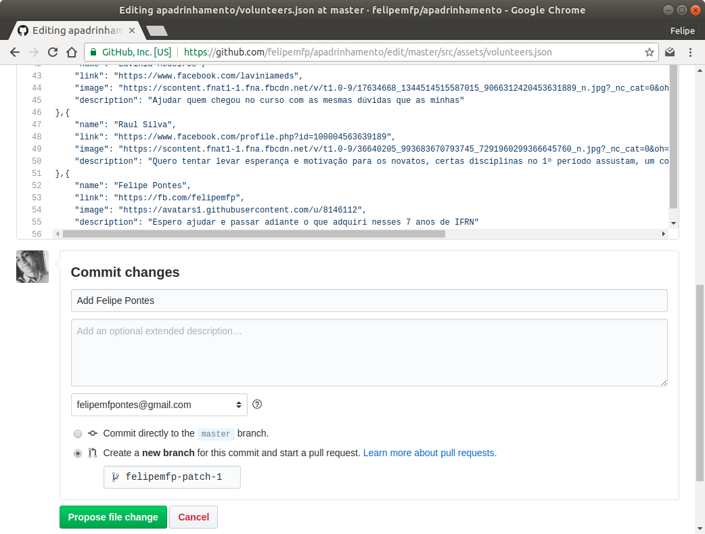
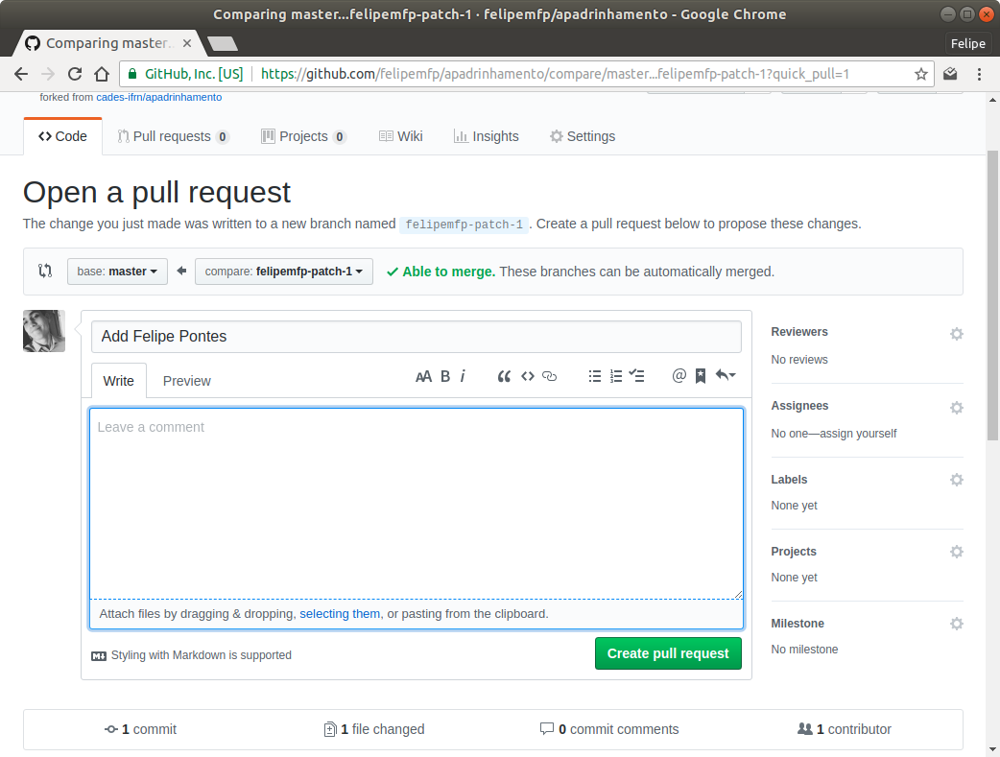

## Como ser um voluntário?

> Não há nenhum requisito para ser um voluntário na iniciativa **Apadrinhamento**. 

Siga os passos a seguir para adicionar suas informações no [mural](https://apadrinhamento.cades.natal.br):

#### Passo 1

Você precisa editar o arquivo [`src/assets/volunteers.json`](src/assets/volunteers.json)

Clique no ícone do lápis.

#### Passo 2

Adicione suas informações no mesmo formato.

* `name`: Seu nome
* `link`: Um link para te conhecer como, por exemplo, Facebook ou Twitter
* `image`: Um link para uma foto sua
* `description`: Um breve mensagem do que você espera

E marque a opção que contém "Create a new branch for this commit and start a pull request".

Clique em `Propose file change`

#### Passo 3

Submeta a Pull Request clicando em `Create pull request`.

Pronto. Já já te adicionaremos no mural.